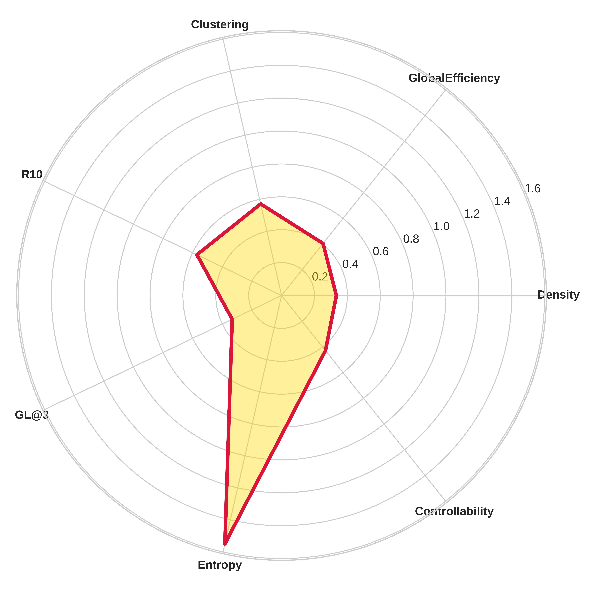
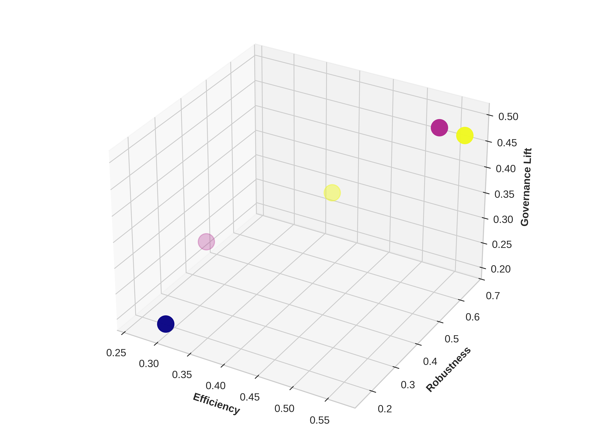
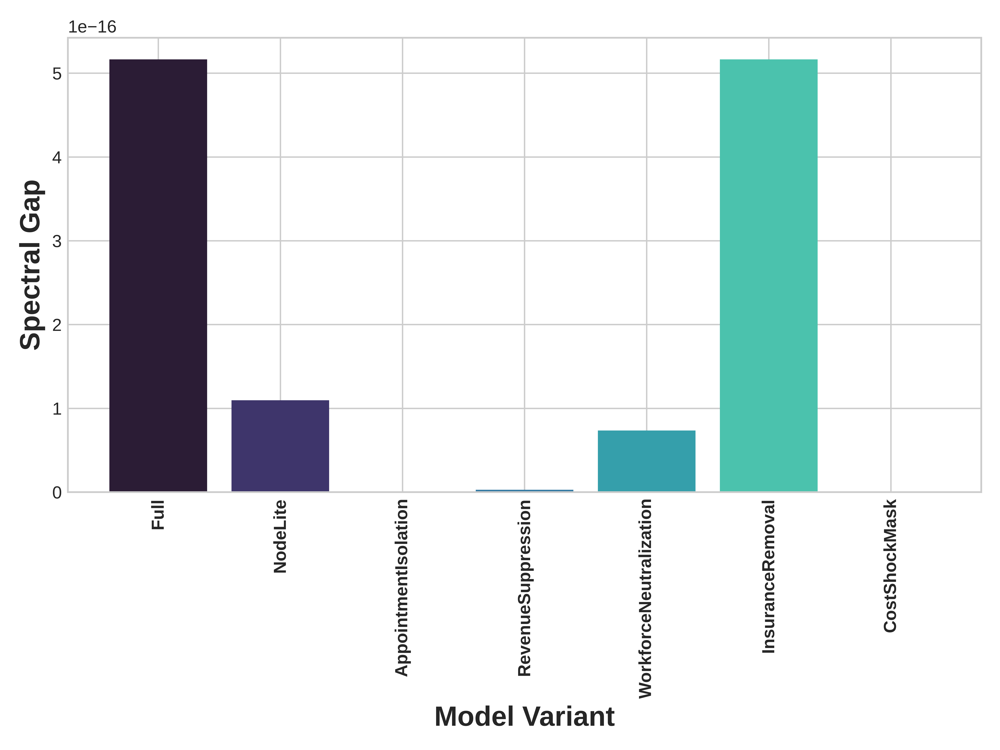
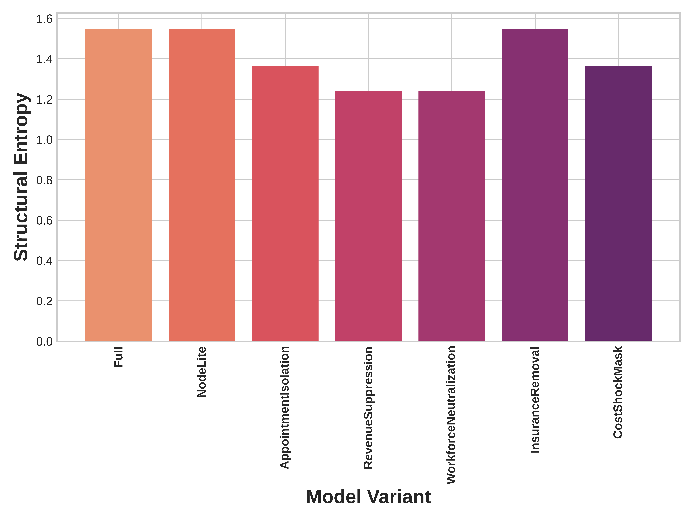
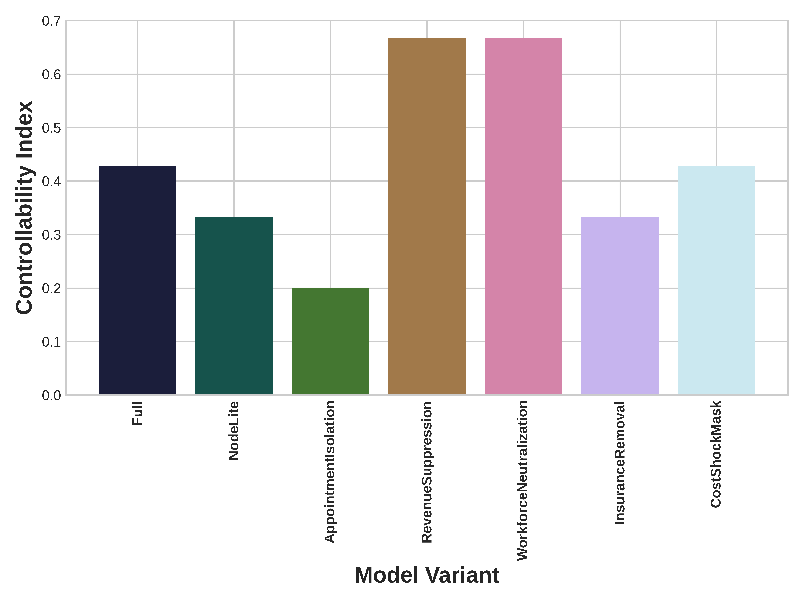
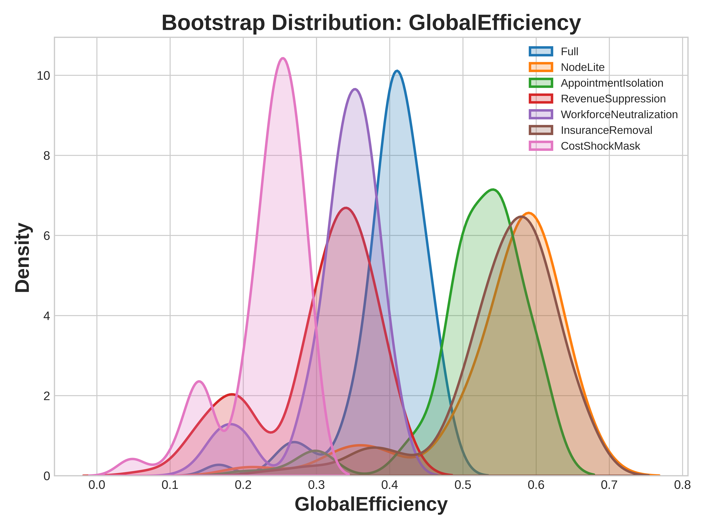
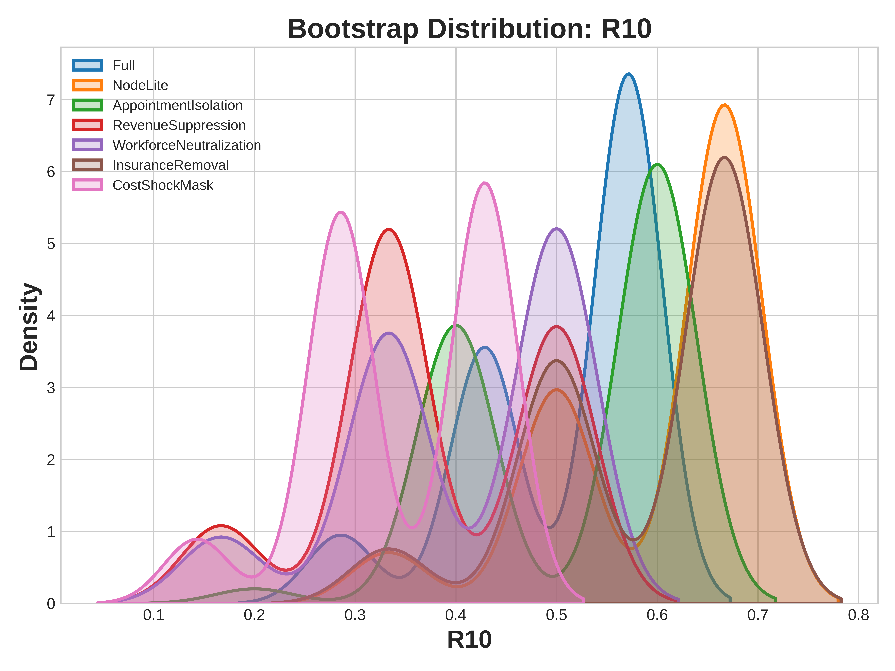
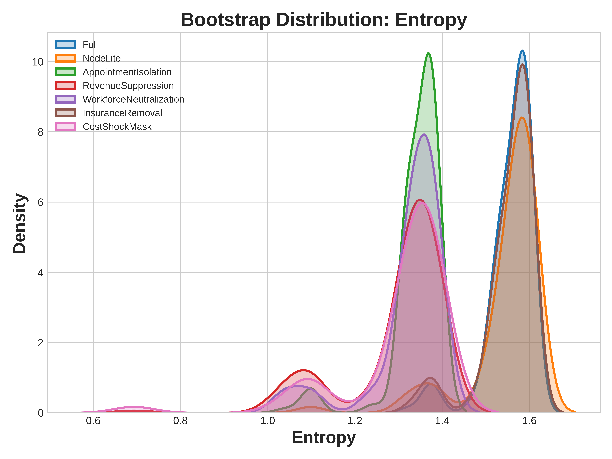

# HPRIM-2026  
## Network-Based Poly-Risk Mapping in Hospital Systems  
### A Systems-Oriented Framework for Leadership and Risk Governance

---

## Overview

HPRIM-2026 introduces a **network-based structural modeling framework** for analyzing interdependencies among hospital operational and financial risk indicators.

Rather than evaluating appointment instability, billing failure, cost volatility, insurance reliance, and physician workload independently, this framework models their **empirical co-variation as a measurable interaction topology**.

The model is:

- Empirical (derived from structured hospital data)
- Non-causal (correlation-based)
- Governance-oriented
- Topology-sensitive
- Stress-tested via ablation and bootstrap stability

---

## Core Contributions

✔ Physician-level risk indicator construction  
✔ Spearman-based interaction network modeling  
✔ Structural metric quantification  
✔ Targeted resilience testing  
✔ Spectral cohesion analysis  
✔ Efficiency–Controllability frontier mapping  
✔ Bootstrap structural stability validation  

---

# Framework Pipeline

1. Construct physician-level risk indicators  
2. Z-score standardization  
3. Spearman correlation network (|ρ| > 0.25)  
4. Compute structural metrics  
5. Perform ablation sensitivity analysis  
6. Conduct resilience and spectral analysis  
7. Validate via bootstrap resampling  

---

# Structural Metrics Across Ablation Variants

| Variant | Density | GlobalEfficiency | Clustering | R10 | GL@3 | Entropy | Controllability |
|----------|----------|-----------------|------------|------|------|---------|----------------|
| Full | 0.3333 | 0.4048 | 0.5714 | 0.5714 | 0.3333 | 1.5498 | 0.4286 |
| NodeLite | 0.4667 | 0.5667 | 0.6667 | 0.6667 | 0.4667 | 1.5498 | 0.3333 |
| AppointmentIsolation | 0.5000 | 0.5500 | 0.6667 | 0.6000 | 0.5000 | 1.3662 | 0.2000 |
| RevenueSuppression | 0.2000 | 0.3000 | 0.0000 | 0.1667 | 0.2000 | 1.2425 | 0.6667 |
| WorkforceNeutralization | 0.2000 | 0.3000 | 0.0000 | 0.1667 | 0.2000 | 1.2425 | 0.6667 |
| InsuranceRemoval | 0.4667 | 0.5667 | 0.6667 | 0.6667 | 0.4667 | 1.5498 | 0.3333 |
| CostShockMask | 0.2381 | 0.2619 | 0.4762 | 0.4286 | 0.2381 | 1.3662 | 0.4286 |

### Interpretation

The baseline configuration exhibits:

- Moderate density (0.3333)
- Elevated clustering (0.5714)
- Distributed connectivity (Entropy = 1.5498)
- Partial structural coupling

Revenue suppression and workload neutralization collapse triadic reinforcement, demonstrating structural concentration around financial and workforce dimensions.

---

# Resilience Metrics

| Variant | AURCₜ | AURCᵣ | F50ₜ | F50ᵣ | R30ₜ | R30ᵣ |
|----------|--------|--------|--------|--------|--------|--------|
| Full | 0.3214 | 0.4964 | 0.25 | 0.30 | 0.1429 | 0.4964 |
| NodeLite | 0.4167 | 0.5833 | 0.30 | 0.45 | 0.1667 | 0.5417 |
| AppointmentIsolation | 0.4250 | 0.5581 | 0.30 | 0.30 | 0.20 | 0.4550 |
| RevenueSuppression | 0.2292 | 0.4115 | 0.10 | 0.10 | 0.1667 | 0.3542 |
| WorkforceNeutralization | 0.2292 | 0.4212 | 0.10 | 0.10 | 0.1667 | 0.3625 |
| InsuranceRemoval | 0.4167 | 0.5682 | 0.30 | 0.45 | 0.1667 | 0.5458 |
| CostShockMask | 0.2679 | 0.4015 | 0.10 | 0.10 | 0.1429 | 0.3929 |

### Interpretation

Targeted disruption produces significantly faster systemic fragmentation than random failure.

This confirms that hospital risk topology is structurally concentrated around bridging indicators.

---

# Bootstrap Stability

| Variant | MeanJaccard | MedianJaccard | BaseEdgeStability | DensitySD | EfficiencySD |
|----------|--------------|---------------|------------------|-----------|--------------|
| Full | 0.6349 | 0.6250 | 0.7696 | 0.0645 | 0.0515 |
| AppointmentIsolation | 0.7371 | 0.8000 | 0.8075 | 0.0971 | 0.0740 |
| RevenueSuppression | 0.4692 | 0.4000 | 0.6833 | 0.0653 | 0.0659 |
| CostShockMask | 0.6642 | 0.6667 | 0.7350 | 0.0555 | 0.0544 |

Structural topology demonstrates stable recurrence under physician resampling.

---

# Visual Results

## Structural Radar

## Density Comparison

## Survival Curve

## Spectral Heatmap

## Efficiency–Controllability Frontier

## 3D Governance Surface

## Spectral Gap

## Entropy Distribution

## Controllability

## Bootstrap Distributions

---

# Positioning Relative to Literature

| Study Domain | Data Level | Interaction Modeled | Governance Link | Structural Network |
|--------------|------------|--------------------|----------------|-------------------|
| Risk documentation | Organizational | No | Indirect | No |
| Scheduling optimization | Clinic/Hospital | No | Operational | No |
| No-show prediction | Patient | No | None | No |
| Cost variability studies | Hospital | No | Financial | No |
| Governance reviews | Institutional | Conceptual | Direct | No |
| **HPRIM-2026** | Hospital | Yes | Direct | Yes |

---

# Dataset

Public Kaggle Dataset:

https://www.kaggle.com/datasets/kanakbaghel/hospital-management-dataset

---
